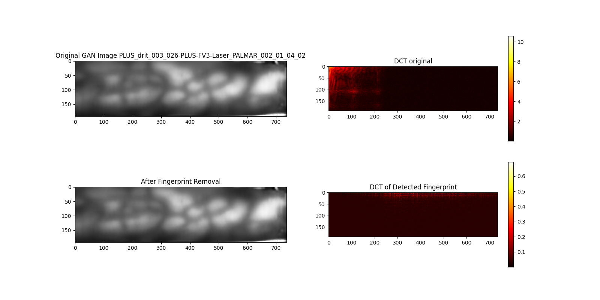
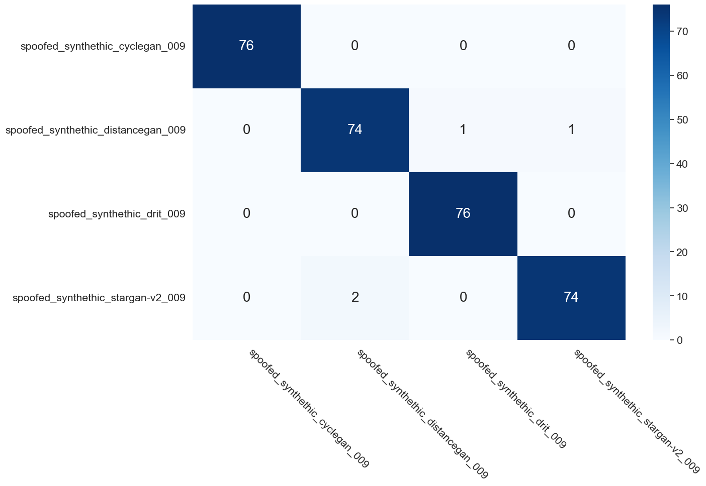
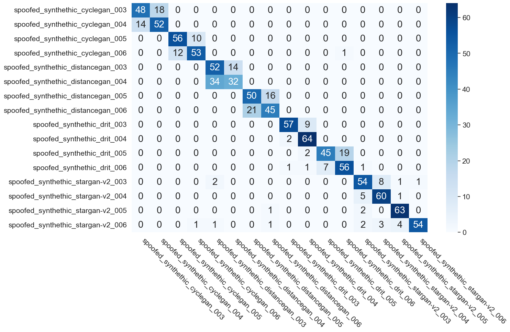
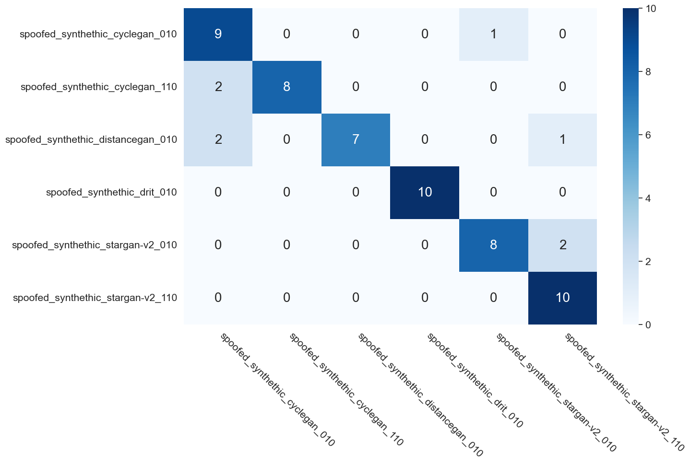
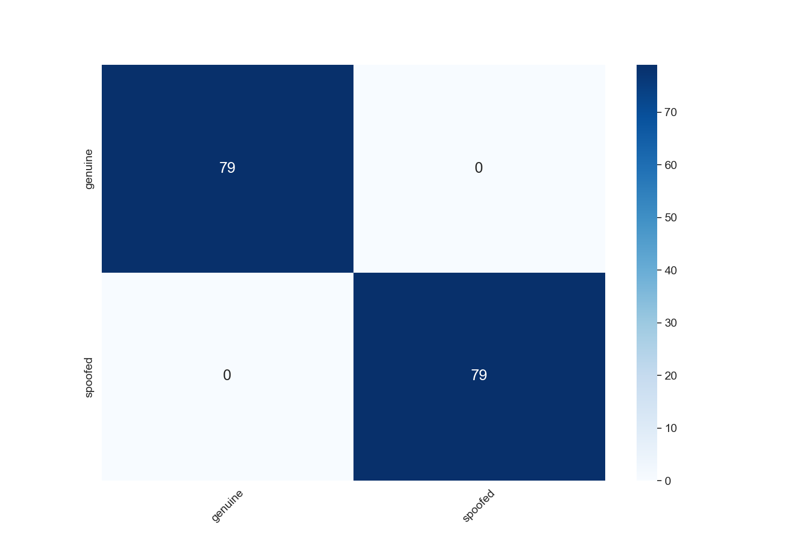
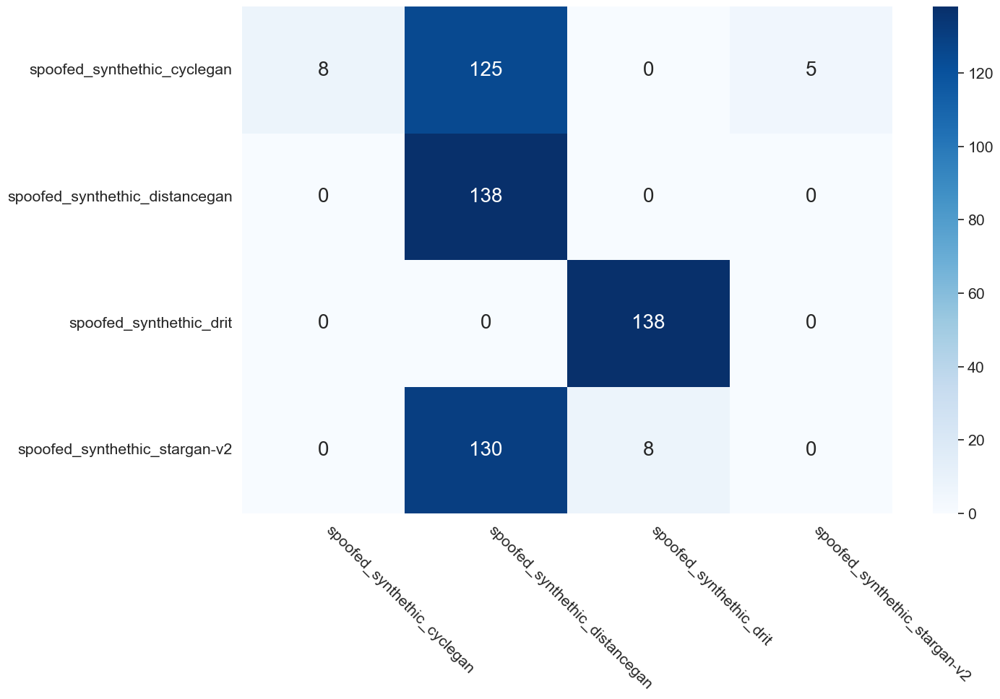
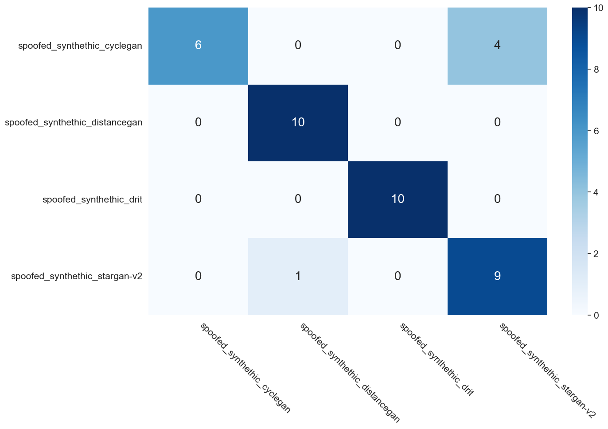
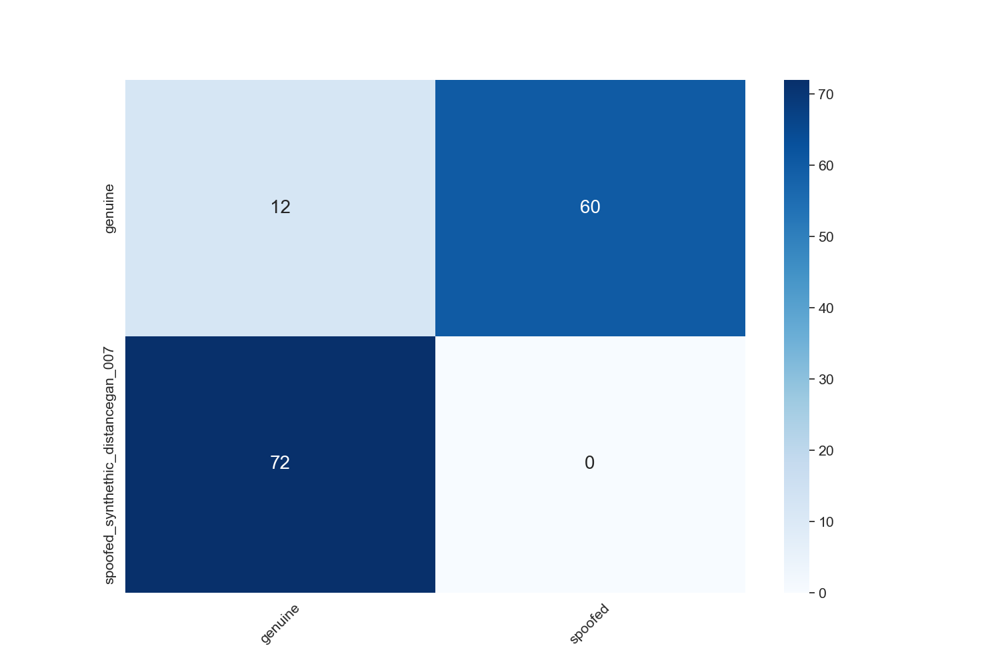

# UNI-AIS-BiometricSystems

## Presentation Outline

### 1. Methodoligical Approach
Explain Border Conditions and first Experiments (e.g. ResNet18, Fingerprints, Resizing, Different Datasets, Different GANs, Different Fingerprint Removal Methods, Different Evaluation Combinations, Different Models, Different Folds)
- Finger print removal
    - mean
        - 
    - peak
        - 
    - bar
        - 
    - regression
        - 

### 2. Hypothesis:
- Intra Dataset
    - A model is able to distinguish between genuine and spoofed images (genuine vs spoofed)
    - A model is able to distinguish between different spoofed variants (gan seperator)
    - The models learn the fingerprints of the different gans (genuinie vs synthetic)
    - The models are not able to distinguish between genuine and spoofed images when the fingerprint is removed (genuinie vs synthetic with removed fingerprint)
    - A model is able to distinguish between genuine and spoofed images when resized in the same dataset (resized genuine vs spoofed)
    - A model is able to distinguish between different spoofed variants when resized in the same dataset (gan seperator)
- Inter Dataset (images resized)
    - A model is able to distinguish between genuine and spoofed images when resized in different datasets (resized genuine vs spoofed)
    - A model is able to distinguish between different spoofed variants when resized in different dataset (gan seperator)
    - A model is able to distinguish between genuine and the same GAN variant over different datasets

### 3. Visual Comparinson of DS

The datasets themselves exhibit variations between genuine, spoofed, and manipulated images, making it difficult to ascertain what the model is truly learning. It remains unclear whether the model is learning the fingerprints or simply recognizing differences in the appearance of images.

### 4. Results:
- Intra Dataset
    - A model is able to distinguish between genuine and spoofed images (genuine vs spoofed)
        - We conclude that this is the case using a fine tuned ResNet18 model
        - IDIAP 
        - PLUS 
        - PROTECT 
        - SCUT 
    - A model is able to distinguish between different spoofed variants (gan seperator)
        - We conclude that this is the case using a finetuned ResNet18 model
        - IDIAP 
        - PLUS 
        - PROTECT 
        - SCUT 
    - The models learn the fingerprints of the different gans (genuinie vs synthetic)
        - We can conclued this is generally not the case. The models are not able to distinguish between genuine and spoofed images when the fingerprint is removed (genuinie vs synthetic with removed fingerprint)
        - However there are exceptions.
            - PLUS drit 003 peak removal 
            - PLUS drit 004 mean removed 
            - PLUS drit 004 peak removal 
            - PROTECT stargan v2 110 bar removed 
            - PROTECT stargan v2 110 mean removed 
            - PROTECT stargan v2 110 peak removed 
            - SCUT distance 007 mean removed 
            - SCUT distance 008 mean removed 
            - SCUT cycle 008 mean removed 
    - The models are not able to distinguish between genuine and spoofed images when the fingerprint is removed (genuinie vs synthetic with removed fingerprint)
        - Since the models do not learn the fingerprint in the majority of the cases we can conclude that the models are able to distinguish between genuine and spoofed images when the fingerprint is removed.
        - As discussed above there are exceptions to this rule.
    - A model is able to distinguish between genuine and spoofed images when resized in the same dataset (resized genuine vs spoofed)
        - We conclude that this is the case using a fine tuned ResNet18 model
        - IDIAP 
        - PLUS 
        - PROTECT 
        - SCUT 
    - A model is able to distinguish between different spoofed variants when resized in the same dataset (gan seperator)
        - We conclude that this is the case using a fine tuned ResNet18 model
        - IDIAP 
        - PLUS 
        - PROTECT 
        - SCUT 
- Inter Dataset (images resized)
    - A model is able to distinguish between different spoofed variants when resized in different dataset (gan seperator)
        - We conclude this does not hold true. The models are not able to distinguish between different spoofed variants when resized in different dataset.
        - model IDIAP eval SCUT 
        - model PLUS eval PROTECT 
        - a notable exception is the model trained on the IDIAP dataset and evaluated on the PROTECT dataset 
    - A model is able to distinguish between genuine and spoofed images when resized in different datasets (resized genuine vs spoofed)
        - We conclude this does not hold true. The models are not able to distinguish between genuine and spoofed images when resized in different datasets.
        - One may suggest that the model trained on the IDIAP dataset and evaluated on the PROTECT dataset is able to distinguish between genuine and spoofed images when resized in different datasets. However, this is not the case. The model is able to distinguish between genuine and the same GAN variant over different datasets.
            - model IDIAP stargan v2 009 eval PROTECT stargan v2 010 
            - model IDIAP drit 009 eval PROTECT cycle 110 
        - a few more examplest where the classification did not work
            - model PLUS drit 005 eval IDIAP spoofed 
            - model PLUS cycle 004 eval SCUT distance 007 
    - A model is able to distinguish between genuine and the same GAN variant over different datasets
        - We conclude that this is not the case. The models are not able to distinguish between genuine and the same GAN variant over different datasets.
            - model IDIAP stargan v2 009 eval PROTECT stargan v2 010 
            - model SCUT drit 007 eval IDIAP drit 009 
            - model PLUS drit 005 eval IDIAP drt 009 
            - model PLUS cycle 004 eval SCUT cycle 008 
            - there are a few examples where the classification did work
                - model PROTECT cycle 110 eval PLUS cycle 004 

This leads us to the conclusion that some models learn the fingerprint of the different trained GANs. However, this is not the case for the majority of the models, since they can still distinguish between genuine and spoofed images when the fingerprint is removed. Furthermore if the models would learn the fingerprint they would be able to distinguish between the same gan variant over different datasets. This is not the case.


## Conf Matrix Structure

### Intra Dataset Results
All results are stored in the `results` directory. The plots of the confusion matrix are stored in the `plots` directory. Where the directory is bulit as follows. There are 4 Folders containing the results of the 4 different datasets. within each the the images are stored with the same naming convention. 

    conf_matrix_cnnParams_resnet18_{DatasetName}_{FoldNumber}_{genuine}_{spoofed variant used}.png

    For DatasetName: PLUS, PROTECT, SCUT, IDIAP
    For FoldNumber: PLUS (003, 004), PROTECT (010, 110), SCUT (007, 008), IDIAP (009), for the real spoofed the folder was left empty
    For genuine and spoofed variant used: we always used the genuie vs some kind of spoofed variant, so the folder name is the name of the spoofed variant used.
    
    e.g. conf_matrix_cnnParams_resnet18_PLUS_003_genuine_spoofed_sythetic_cyclegan.png
    Here we used the PLUS dataset, folder 003, and the genuine vs the synthetic cyclegan spoofed variant. but evaluated with genuine vs spoofed.

**Gan Seperator**
The gan seperator is used to seperate the different spoofed variants. The naming convention is as follows:

    conf_matrix_cnnParams_resnet18_{DatasetName}_ganSeperator.png

    For DatasetName: PLUS, PROTECT, SCUT, IDIAP

    e.g. conf_matrix_cnnParams_resnet18_PLUS_ganSeperator.png
    Here we used the PLUS dataset to seperate the gans from each other.

**Gan Fingerprint Removal**

Here the intra dataset was used to evaluate the performance of the model on the same dataset but with the fingerprint removed. The naming convention is as follows:

    conf_matrix_{DatasetName}_{FoldNumber}_{genuine}_{spoofed variant used}_{removalMethod}.png

    For removalMethod: we used the following methods: mean, peak, bar

    e.g. conf_matrix_PLUS_003_genuine_spoofed_synthetic_cyclegan_mean.png
    Here we used the PLUS dataset, folder 003, and the genuine vs the synthetic cyclegan spoofed variant. but evaluated with genuine vs synthetic cyclegan with the mean fingerprint removed.

### Inter Dataset Results
In the case where we resized the images all to the same size we used the following naming convention. First we split apart the different evaluation combinations into folders. This gives us the folling folder convention:

    m_{Model Trained DS}_e_{Evaluation DS}

    e.g. m_PROTECT_e_PLUS
    Here we used the PROTECT dataset to train the model and the PLUS dataset to evaluate the model.

Within each of these folders we used a similar naming convention as above. The only difference since we add the model and evaluation typ to the name.

    conf_matrix_resized_model_{Model Trained DS}_{genuine}_{spoofed variant used}_{folder train}_eval_{Eval DS}_{genuine}_{spoofed variant used}_{folder eval}.png 

    Model Trained DS: PLUS, PROTECT, SCUT, IDIAP
    Eval DS: PLUS, PROTECT, SCUT, IDIAP
    genuine and spoofed variant used: we always used the genuie vs some kind of spoofed variant, so the folder name is the name of the spoofed variant used.
    folder train: PLUS (003, 004), PROTECT (010, 110), SCUT (007, 008), IDIAP (009), for the real spoofed the folder was left empty
    folder eval: PLUS (003, 004), PROTECT (010, 110), SCUT (007, 008), IDIAP (009), for the real spoofed the folder was left empty

    e.g. conf_matrix_resized_model_PROTECT_genuine_spoofed_sythetic_cyclegan_010_eval_PLUS_genuine_spoofed_sythetic_distancegan_003.png
    This image will be in the folder m_PROTECT_e_PLUS and is the result of the model trained on PROTECT with the genuine vs synthetic cyclegan spoofed variant with folder 010 and evaluated on the PLUS dataset with the genuine vs synthetic distancegan spoofed variant with folder 003.

**Gan Seperator**

Since there are different folders in each of the datasets we just use the gan seperator to seperate the different spoofed variants and not the different settings. The naming convention is as follows:

    conf_matrix_resized_model_{Model Trained DS}_eval_{Eval DS}_ganSeperator.png

    Model Trained DS: PLUS, PROTECT, SCUT, IDIAP
    Eval DS: PLUS, PROTECT, SCUT, IDIAP

    e.g. conf_matrix_resized_ganSeperator_model_PROTECT_eval_PLUS.png
    This image will be in the folder m_PROTECT_e_PLUS and is the result of the model trained on PROTECT to sepereate the differnte gans and evaluated on the PLUS dataset.


## Dataset & Structure

The dataset is available [here]. The expanded dataset should be just put under the `data` directory. This way the directory structure should look like this:

```
data
├── prepare
│   ├── PLUS
│   │   ├── genuine
│   │   ├── spoofed
│   │   ├── spoofed_sythetic_cyclegan
│   │   ├── spoofed_sythetic_distancegan
│   ├── PROTECT
│   │   ├── genuine
│   │   ├── spoofed
│   │   ├── spoofed_sythetic_cyclegan
│   ├── SCUT
│   │   ├── genuine
│   │   ├── spoofed
│   │   ├── spoofed_sythetic_cyclegan
│   ├── VERA
│   │   ├── genuine
│   │   ├── spoofed
│   │   ├── spoofed_sythetic_cyclegan

```


[here]: https://www.cosy.sbg.ac.at/~uhl/Data_prepared.zip
